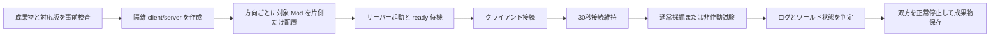

# Amber Delta / Liteminer Delta 非対称 TeaKit テスト実施計画

## 0. 文書の状態

- 状態: **計画のみ（未実装・未実行）**
- 対象: Amber Delta と Liteminer Delta のクライアント／サーバー非対称構成
- 必須 Minecraft 版: **26.2、1.21.1、1.20.1**
- 時間に余裕がある場合: 現在 Liteminer Delta が対応するその他の版、その後 Amber Delta の主要境界版
- この計画の作成時点では、ビルド、依存関係の取得、Minecraft／TeaKit の起動、テスト実行を行わない。

## 1. 目的と合格条件

確認したい契約は次の2方向である。

1. **Delta クライアント → 対象 Mod なしサーバー**
   - クライアントに Amber Delta と Liteminer Delta が入っていても、サーバー接続を拒否されない。
   - 接続後も切断（kick）されない。
   - Liteminer Delta の操作キーを押して鉱石を破壊しても、一括破壊は作動せず、狙った1ブロックだけが破壊される。
2. **対象 Mod なしクライアント → Delta サーバー**
   - サーバーに Amber Delta と Liteminer Delta が入っていても、対象 Mod を持たないクライアントが接続を拒否されない。
   - 接続後も切断されず、通常の採掘ができる。

ここでいう「対象 Mod なし」は **Amber Delta と Liteminer Delta がない**という意味であり、試験制御に必要な TeaKit、ModStage、ローダーおよび通常の実行依存関係は許可する。TeaKit 自体の存在が Amber／Liteminer の通信チャネルを登録しないことを、事前検査で確認する。

各ケースは次をすべて満たしたときだけ合格とする。

- ログイン完了後30秒間、接続が維持される。
- `latest.log` に mod mismatch、required channel、registry mismatch、handshake rejection、disconnect がない。
- Delta クライアント側ケースでは、隣接する同種鉱石3個のうち照準ブロックだけが空気になり、残り2個が維持される。
- 対象 Mod なしクライアント側ケースでは、通常採掘を1回行った後も接続が維持される。
- クライアントとサーバーの双方がクラッシュせず、TeaKit が正常終了を報告する。

## 2. 試験スイートの分離

原因を切り分けられるように、2つのスイートを分ける。

### A. Amber 単体の非対称接続試験

- `amber-client`: クライアントだけに Amber Delta を配置する。
- `amber-server`: サーバーだけに Amber Delta を配置する。
- 両方向でログイン、30秒維持、通常採掘、切断なしを確認する。
- Liteminer Delta はどちらにも入れない。

### B. Liteminer + Amber の非対称機能試験

- `delta-client`: クライアントだけに Liteminer Delta と Amber Delta を配置する。
- `delta-server`: サーバーだけに Liteminer Delta と Amber Delta を配置する。
- `delta-client` では、一括破壊キーを押しても照準ブロック以外が壊れないことを必須アサーションにする。
- このスイートにより、Amber 単体ではなく Liteminer の有効化ゲートまで含めた契約を確認する。

Amber 単体スイートを先に実行し、そこで接続に失敗した場合は Liteminer スイートを続行せず、Amber のハンドシェイク問題として報告する。

## 3. 優先度付きマトリクス

### P0: 必須

| Minecraft | ローダー | Amber 単体 | Liteminer + Amber | 現時点の状態 |
|---|---|---:|---:|---|
| 26.2 | Fabric / Forge / NeoForge | 6ケース | 6ケース | 実行可能な構成あり |
| 1.21.1 | Fabric / Forge / NeoForge | 6ケース | 6ケース | Amber は構成あり。Liteminer は版定義がなく実行前提未達 |
| 1.20.1 | Fabric / Forge | 4ケース | 4ケース | Amber は構成あり。Liteminer は版定義がなく実行前提未達 |

ケース数は「ローダー数 × 2方向」。1.20.1 の NeoForge は Amber Delta の対応ローダーに含まれないため **N/A** とし、失敗や未実施には数えない。

P0 は合計32ケースである。

- 現状そのまま実行候補にできるもの: Amber 単体16ケース + 26.2 Liteminer 6ケース = 22ケース
- Liteminer の版追加後に実行可能になるもの: 1.21.1 の6ケース + 1.20.1 の4ケース = 10ケース

**重要:** 現在の Liteminer Delta リポジトリには `1.21.1` と `1.20.1` の版定義がない。したがって、この2版の Liteminer 複合試験は、対応版を移植して成果物を生成できる状態になるまで `BLOCKED_PREREQUISITE` と記録する。成果物がないまま別版の jar を代用してはならない。

### P1: 時間があれば実施

現在 Liteminer Delta が公開対象として持つ残りの版を優先する。

| Minecraft | ローダー | 対象スイート | 最大ケース数 |
|---|---|---|---:|
| 1.21.11 | Fabric / Forge / NeoForge | Amber 単体 + Liteminer 複合 | 12 |
| 26.1 | Fabric / Forge / NeoForge | Amber 単体 + Liteminer 複合 | 12 |
| 26.1.1 | Fabric / Forge / NeoForge | Amber 単体 + Liteminer 複合 | 12 |
| 26.1.2 | Fabric / Forge / NeoForge | Amber 単体 + Liteminer 複合 | 12 |

時間制限時は、各版でまず Fabric の2方向を実施し、次に Forge、最後に NeoForge とする。一部だけ終わった版は「版全体合格」と扱わない。

### P2: さらに時間があれば実施

Amber Delta の全対応版を総当たりする代わりに、最初はプロトコル／ローダー境界を代表する版を選ぶ。候補は 1.14.4、1.16.5、1.18.2、1.19.4、1.20.6、1.21.4、1.21.8、1.21.11、26.1.2 とし、その後に残りの対応版へ拡張する。各版では、その版が実際に対応しているローダーだけを対象にする。

## 4. 実装予定の TeaKit 構成

実装フェーズでは既存の `test/teakit/liteminer.test.ts` を変更せず、非対称試験を独立させる。

予定ファイル:

- `test/teakit/asymmetric.test.ts`: ログイン維持、通常採掘、一括破壊不作動のアサーション
- `test/teakit/asymmetric-matrix.toml`: 版、ローダー、優先度、方向、配置 Mod、対応可否を一元管理
- `scripts/run-asymmetric-teakit.ps1`: サーバーとクライアントを別 game directory／別プロセスで起動し、TeaKit 実行と後始末を行うオーケストレーター
- `justfile`: P0、P1、単一ケース実行用の入口を追加

提案するコマンドインターフェース（**現時点では未実装であり、実行しない**）:

```text
just test-asymmetric-case 26.2-fabric delta-client
just test-asymmetric-p0
just test-asymmetric-p1
just test-asymmetric-all
```

実行ディレクトリはケースごとに分離する。

```text
build/asymmetric-teakit/<run-id>/<minecraft>-<loader>/<suite>-<direction>/
  client/
  server/
  artifacts/
```

既存の開発用 `runs/client` や `run` に Mod を出し入れして使い回さない。これにより、前ケースの jar、config、world、サーバーキャッシュが次ケースへ混入するのを防ぐ。

## 5. 1ケースの実行手順



詳細:

1. 対象版・ローダーの Liteminer／Amber／TeaKit jar と実行依存関係が揃っているか検査する。
2. クライアントと dedicated server の隔離ディレクトリを作る。
3. マニフェストどおり片側だけに対象 Mod を配置し、実際の `mods` 一覧を成果物へ保存する。
4. EULA 受諾済みの一時サーバーを、動的に確保したローカルポート、offline mode、専用ワールドで起動する。
5. `Done` と TeaKit ready の双方を待ってからクライアントを起動する。
6. 接続、30秒維持、採掘、ブロック状態確認を行う。
7. クライアント／サーバーログを解析し、TeaKit のアサーションと合わせて判定する。
8. 正常終了を要求し、失敗時もプロセスを強制回収する。

## 6. 試験データとアサーション

### Delta クライアント → 対象 Mod なしサーバー

- サーバー側に横一列の石炭鉱石を3個設置する。
- クライアントで一括破壊キーを押しながら中央を採掘する。
- 中央だけが空気になり、左右は石炭鉱石のままであることをサーバー側 TeaKit API から確認する。
- キー入力前後と採掘後で接続が維持されることを確認する。
- Liteminer の表示上の無効状態を取得できる場合は補助アサーションにするが、ブロック状態の確認を主判定とする。

### 対象 Mod なしクライアント → Delta サーバー

- 対象 Mod を持たない TeaKit クライアントで接続する。
- 石炭鉱石を通常採掘し、中央だけが破壊されることを確認する。
- 30秒待機後と採掘後の双方で接続が維持されることを確認する。
- サーバーに Amber Delta／Liteminer Delta が実際にロードされた証跡をサーバーログから保存する。

### Amber 単体

- ログインと通常採掘だけを行い、Liteminer 固有のキー操作やコマンドは使わない。
- これにより接続拒否が Amber 由来か Liteminer 由来かを区別する。

## 7. 実行制御、再試行、失敗分類

- 標準は **1ケースずつ直列実行**。安定後も並列度は最大2とし、同じ版・ローダーを同時実行しない。
- ケースの制限時間は、サーバー準備3分、クライアント準備3分、試験本体2分、停止1分を目安にする。
- ポート競合、ダウンロード一時失敗、TeaKit ready timeout のようなインフラ失敗だけ1回再試行する。
- handshake rejection、kick、クラッシュ、誤った一括破壊は再試行で成功扱いにせず、製品失敗として保存する。
- 1ケース失敗で全体を止めず、同じ版・ローダーの逆方向まで収集する。ただし Amber 単体が失敗したノードでは Liteminer 複合をスキップし、根本原因を重複報告しない。

失敗分類:

- `PRODUCT_HANDSHAKE`: Mod／channel／registry 不一致による接続拒否
- `PRODUCT_BEHAVIOR`: 接続は成功するが、一括破壊が誤作動する
- `PRODUCT_CRASH`: クライアントまたはサーバーのクラッシュ
- `HARNESS`: TeaKit、ポート、起動、入力制御の問題
- `BLOCKED_PREREQUISITE`: 対象版の成果物や版定義が存在しない
- `N/A`: その版でローダーがサポートされない

## 8. 保存する成果物

各ケースで次を `artifacts` に保存する。

- クライアント／サーバーの `latest.log` と crash report
- 実際に配置した jar のファイル名、SHA-256、Mod ID、版の一覧
- Minecraft、ローダー、Java、TeaKit の版
- 接続開始、ログイン完了、採掘、切断、終了の時刻
- TeaKit のテスト結果（JUnit または JSON）
- ブロック3個の試験前後状態
- 失敗時スクリーンショット
- 再現用の単一ケースコマンド

総括レポートでは P0／P1 を分け、未実施、失敗、`BLOCKED_PREREQUISITE`、`N/A` を合格と混同しない。

## 9. 実施体制

### 主担当（設計・判定）

- P0 の対象、期待動作、例外の変更を承認する。
- 製品不具合とハーネス不具合の最終分類を行う。
- `1.21.1`／`1.20.1` の Liteminer 移植が必要になった場合、別作業として実装とレビューを行う。

### GPT-5.6 Luna（実行・監視担当として利用可能）

- 実装済みコマンドから P0 を順番に実行し、プロセス、タイムアウト、成果物を監視する。
- インフラ失敗だけ規定どおり1回再試行する。
- テスト、期待値、製品コードを独断で変更しない。
- `PRODUCT_*`、同一ノードの連続 `HARNESS`、成果物欠落が発生したら停止して主担当へ引き継ぐ。
- P0 完了後、残り時間に応じて P1 を Fabric → Forge → NeoForge の順で進める。

### 独立レビュー

- ハーネス実装後、Mod の配置が本当に非対称か、TeaKit が対象通信を補っていないか、判定がログだけに依存していないかをレビューする。
- 初回 P0 実行前に、各方向1ケースずつマニフェストと実際の `mods` ディレクトリを照合する。

## 10. 実行開始前ゲート

実行は、次がすべて満たされ、別途「実行してよい」という指示を受けた後に開始する。

- [ ] 非対称 TeaKit ハーネスの実装と独立レビューが完了している。
- [ ] 26.2 の3ローダーで client/server の隔離起動ができる。
- [ ] Amber Delta について 1.21.1 の3ローダー、1.20.1 のFabric／Forge成果物がある。
- [ ] Liteminer 複合の必須範囲に 1.21.1／1.20.1 を含める場合、Liteminer Delta の対応版が実装・ビルド済みである。
- [ ] TeaKit のみの対照試験で、TeaKit が Amber／Liteminer の通信契約を代替しないと確認できている。
- [ ] 固定されたテストマニフェスト、タイムアウト、失敗分類、成果物保存先がレビュー済みである。
- [ ] 実行中の開発サーバーや同じポートを使うプロセスがない。

## 11. リリース判定

- P0 の実行可能な全ケースが合格し、失敗・未実施がないことを必須とする。
- `BLOCKED_PREREQUISITE` は合格ではない。該当 Minecraft 版を Liteminer Delta の対応版として公開する場合は、移植後に必ず解消する。
- 1.20.1 NeoForge のような正式非対応組み合わせは `N/A` として明示する。
- P1／P2 の結果は追加保証として公開資料に使えるが、部分実施を「全対応版で検証済み」と表現しない。

## 12. 概算（実行時の目安）

- ハーネス実装・初期安定化: 4〜8時間
- 現在実行候補の P0 22ケース: キャッシュ済みで約45〜90分
- Liteminer 旧版移植後の P0 全32ケース: キャッシュ済みで約60〜120分
- P1 最大48ケース: 追加で約90〜180分

初回依存関係取得、Minecraft の起動速度、ローダー固有のクラッシュ調査は別枠とする。Luna に実行・監視を担当させる場合も、壁時計時間は大きく短縮しないが、手動監視負担は減らせる。
